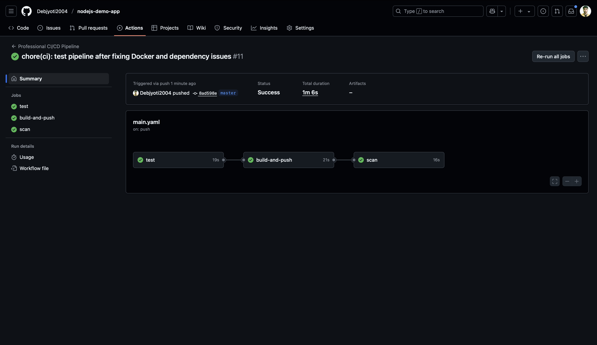
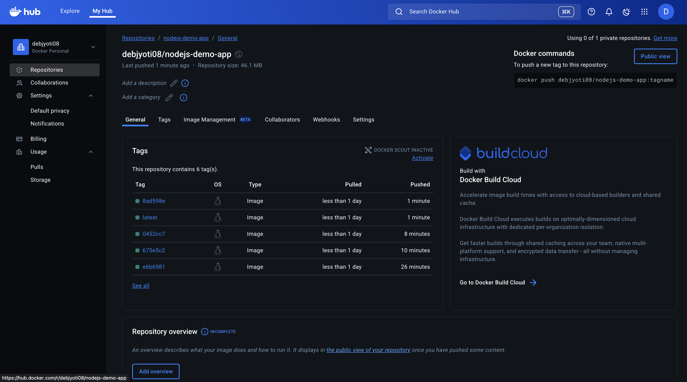

# Automated Node.js Deployment with CI/CD

This repository contains a simple Node.js Express application that is automatically tested, built into a Docker image, and deployed to Docker Hub using a professional CI/CD pipeline built with GitHub Actions.

## 🚀 Overview

The primary goal of this project is to demonstrate a modern DevOps workflow. Every time code is pushed to the `master` branch, a series of automated jobs are triggered to ensure code quality, security, and a seamless deployment process.

## 🛠️ Tech Stack

* **Application**: Node.js, Express
* **CI/CD**: GitHub Actions
* **Containerization**: Docker
* **Image Registry**: Docker Hub
* **Testing**: Jest (Unit Tests), ESLint (Linting)
* **Security**: Trivy (Vulnerability Scanning)

## ⚙️ The CI/CD Pipeline

The entire automation is defined in the `.github/workflows/main.yml` file. The pipeline is triggered on every `push` or `pull_request` to the `master` branch and consists of three sequential jobs.



1.  **`test` Job**:
    * Checks out the source code.
    * Installs Node.js dependencies.
    * Runs the linter (`npm run lint`) to enforce code quality.
    * Runs unit tests (`npm test`) to ensure functionality.
    * This job must pass before the next job can begin.

2.  **`build-and-push` Job**:
    * This job only runs if the `test` job succeeds and the trigger is a push to `master`.
    * Logs into Docker Hub using encrypted secrets.
    * Builds a Docker image from the `Dockerfile`.
    * Tags the image with two labels: `latest` and the unique Git commit SHA for traceability.
    * Pushes the tagged image to the Docker Hub registry.

3.  **`scan` Job**:
    * After the image is pushed, this job starts.
    * It uses Trivy to scan the newly pushed Docker image for any `HIGH` or `CRITICAL` level security vulnerabilities.
    * If a critical vulnerability is found, the pipeline fails, alerting the team to a potential security risk.

## 🐳 Docker Image Deployment

Upon a successful pipeline run, the application's Docker image is pushed to a public repository on Docker Hub. This image can then be pulled and deployed to any server or cloud environment.



## ⚡ How It Works

The automation ensures that no code can be deployed without passing all quality and security gates.

1.  A developer pushes code to the `master` branch.
2.  GitHub Actions automatically triggers the `test` job.
3.  If tests pass, the `build-and-push` job creates and deploys the Docker image.
4.  Finally, the `scan` job verifies the security of the deployed image.

This entire process requires zero manual intervention.

## 💻 Running Locally

To run this application on your local machine, follow these steps:

1.  **Clone the repository:**
    ```bash
    git clone https://github.com/Debjyoti2004/nodejs-demo-app.git
    cd nodejs-demo-app.git
    ```

2.  **Install dependencies:**
    ```bash
    npm install
    ```

3.  **Run in development mode:**
    This command uses `nodemon` to automatically restart the server on file changes.
    ```bash
    npm run dev
    ```

The application will be available at `http://localhost:3000`.

